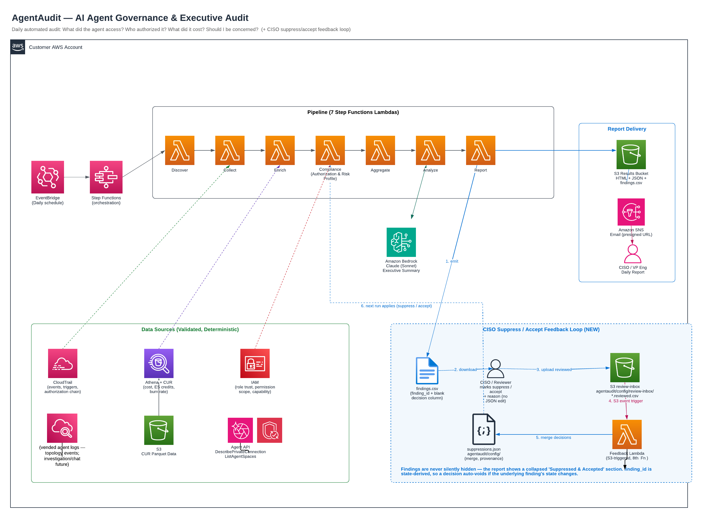
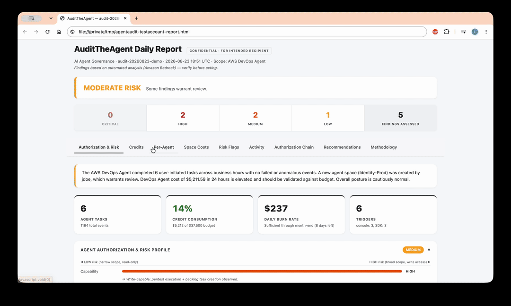

# AuditTheAgent — Daily Executive Audit Reports for AWS AI Agents

**Auditing the agent, not building another one.**

> What did the agent access? Who authorized it? What did it cost? Did anything drift? Should I be concerned?

[](https://opensource.org/licenses/MIT-0) [](https://www.python.org/downloads/) [](https://aws.amazon.com/serverless/sam/)

> **⚠️ Important:** This is sample code for demonstration and educational purposes only. It is not intended for production use without thorough review, testing, and hardening by your organization's security and engineering teams. This solution has not been subjected to a full production security review by AWS. Use at your own risk and validate all outputs before making operational decisions.

## Overview

Organizations adopting AWS AI agents (DevOps Agent, Security Agent) face a trust gap: security leadership needs daily visibility into what autonomous agents are doing before approving production deployment.

AuditTheAgent is a serverless pipeline that generates interactive executive dashboards answering five questions:

1. **What did the agent access?** — CloudTrail-sourced, deterministic
2. **Who authorized it?** — Trigger classification (webhook, console, EventBridge, MCP)
3. **What did it cost?** — CUR-first, per-space, per-operation, credit burn tracking
4. **Is it a risk?** — Trust Posture (5 dimensions, rules-based)
5. **Should I be concerned?** — AI summary with deterministic guardrails

## Quick Start

### Prerequisites

- AWS SAM CLI installed
- AWS account with DevOps Agent or Security Agent active
- A deploy principal with IAM-policy permissions (`iam:PutRolePolicy`,
  `iam:GetRole`, `iam:CreateRole`). The stack attaches inline policies to its
  Lambda execution roles, so a PowerUser-only role cannot create/update it and
  the deploy will fail with `AccessDenied` on the function roles.
- (Optional) CUR configured in Athena for cost attribution
- (Optional) Enterprise Support for credit tracking

### Deploy

Use guided deploy — it prompts for each parameter, handles values with spaces
(e.g. `ScheduleExpression`) correctly, and saves your answers to
`samconfig.toml` for repeatable re-deploys:

```bash
git clone https://github.com/aws-samples/sample-audit-the-agent.git
cd sample-audit-the-agent
sam build
sam deploy --guided
```

> Tip: prefer `--guided` (or editing `samconfig.toml`) over the
> `--parameter-overrides` CLI shorthand — the shorthand splits values on spaces,
> which truncates parameters like `rate(1 day)`.

### Trigger Manually

```bash
aws stepfunctions start-execution \
  --state-machine-arn $(aws cloudformation describe-stacks --stack-name agentaudit \
    --query 'Stacks[0].Outputs[?OutputKey==`StateMachineArn`].OutputValue' --output text) \
  --input '{}'
```

### View Report

```bash
aws s3 ls s3://agentaudit-results-$(aws sts get-caller-identity --query Account --output text)/agentaudit/ --recursive | tail -1
```

## Architecture



**Pipeline:** EventBridge (daily) → Step Functions → 7 Lambda functions → S3 + SNS

**Data Sources (validated, deterministic):**
| Source | What It Provides | Function |
|--------|-----------------|----------|
| CloudTrail | Events, triggers, users, authorization chain | Collect |
| CUR (Athena) | Per-space cost, ES credits, daily burn rate | Enrich |
| IAM | Role trust policies, permission scope, capability level | Trust Posture |
| CloudWatch | ConsumedInvestigationTime metric | Collect |
| Agent API | DescribePrivateConnection (MCP visibility) | Trust Posture |

## Parameters

The tool runs out-of-the-box with all defaults — every parameter is optional.
Guided deploy (`sam deploy --guided`) prompts for each one; the "When to set"
column tells you whether to supply a value or just press Enter.

| Parameter | Default | When to set | Description |
|-----------|---------|-------------|-------------|
| `CurDatabase` | — | **Recommended** | Athena database with the CUR table. Enables per-space cost & credit tracking. |
| `CurTable` | — | **Recommended** | CUR table name in Athena. |
| `CurSourceBucket` | — | **Recommended** | S3 bucket holding CUR Parquet data (Athena reads it from here). |
| `AthenaOutputBucket` | — | **Recommended** | S3 bucket for Athena query results. |
| `NotificationEmail` | — | **Recommended** | Email for report delivery (SNS). Without it, reports land in S3 only. |
| `AgentTypes` | `devops` | Optional | `devops`, `security`, or `both`. |
| `BedrockModelId` | `us.anthropic.claude-sonnet-4-6` | Optional | Bedrock model for the AI summary. |
| `ScheduleExpression` | `rate(1 day)` | Optional | Report frequency (EventBridge schedule). |
| `AthenaWorkgroup` | `primary` | Optional | Athena workgroup for CUR queries. |
| `EnableUrlShortening` | `false` | Optional | Opt-in TinyURL shortening for presigned report URLs (sends URL to a third party). |
| `AgentRoleArns` | — | Optional (auto-discovered) | Agent IAM role ARNs. Leave empty to auto-discover. |
| `VendedLogGroup` | — | Optional (auto-discovered) | DevOps Agent vended-log group. Leave empty to auto-discover. |
| `MonthlyESCharge` | `0` | Optional (fallback) | Fallback ES charge for credit tracking; auto-derived from CUR when available. |
| `CurCrossAccountRoleArn` | — | Optional (advanced) | IAM role ARN in the CUR account for cross-account queries (see below). |

> Agent space names are resolved automatically from the DevOps Agent API — no
> UUID→name mapping needs to be supplied.

**Changing parameters after deployment** is non-destructive — just run `sam deploy` again with updated values. No data loss or resource recreation.

### Cross-Account CUR Setup

Most enterprises keep CUR in the **payer/management account** while agents run in linked accounts. To enable cross-account cost queries, deploy the following role in the account where CUR/Athena resides:

```yaml
AWSTemplateFormatVersion: '2010-09-09'
Description: AuditTheAgent - Cross-account CUR read-only role (deploy in payer/CUR account)

Parameters:
  AgentAuditAccountId:
    Type: String
    Description: Account ID where AuditTheAgent is deployed

  CurDatabaseName:
    Type: String
    Default: cur_db
    Description: Athena database containing CUR table

  CurSourceBucketName:
    Type: String
    Description: S3 bucket with CUR Parquet data

  AthenaOutputBucketName:
    Type: String
    Description: S3 bucket for Athena query results

Resources:
  AgentAuditCURRole:
    Type: AWS::IAM::Role
    Properties:
      RoleName: AgentAudit-CUR-ReadOnly
      AssumeRolePolicyDocument:
        Version: '2012-10-17'
        Statement:
          - Effect: Allow
            Principal:
              AWS: !Sub 'arn:aws:iam::${AgentAuditAccountId}:root'
            Action: sts:AssumeRole
            Condition:
              StringLike:
                aws:PrincipalArn: !Sub 'arn:aws:iam::${AgentAuditAccountId}:role/agentaudit-*'
      Policies:
        - PolicyName: AthenaQueryExecution
          PolicyDocument:
            Version: '2012-10-17'
            Statement:
              - Effect: Allow
                Action:
                  - athena:StartQueryExecution
                  - athena:GetQueryExecution
                  - athena:GetQueryResults
                  - athena:StopQueryExecution
                Resource: !Sub 'arn:aws:athena:${AWS::Region}:${AWS::AccountId}:workgroup/primary'
        - PolicyName: GlueCatalogAccess
          PolicyDocument:
            Version: '2012-10-17'
            Statement:
              - Effect: Allow
                Action:
                  - glue:GetTable
                  - glue:GetDatabase
                  - glue:GetPartitions
                Resource:
                  - !Sub 'arn:aws:glue:${AWS::Region}:${AWS::AccountId}:catalog'
                  - !Sub 'arn:aws:glue:${AWS::Region}:${AWS::AccountId}:database/${CurDatabaseName}'
                  - !Sub 'arn:aws:glue:${AWS::Region}:${AWS::AccountId}:table/${CurDatabaseName}/*'
        - PolicyName: S3ReadCurData
          PolicyDocument:
            Version: '2012-10-17'
            Statement:
              - Effect: Allow
                Action:
                  - s3:GetObject
                  - s3:ListBucket
                Resource:
                  - !Sub 'arn:aws:s3:::${CurSourceBucketName}'
                  - !Sub 'arn:aws:s3:::${CurSourceBucketName}/*'
        - PolicyName: S3WriteQueryResults
          PolicyDocument:
            Version: '2012-10-17'
            Statement:
              - Effect: Allow
                Action:
                  - s3:PutObject
                  - s3:GetObject
                Resource:
                  - !Sub 'arn:aws:s3:::${AthenaOutputBucketName}/agentaudit-queries/*'
              - Effect: Allow
                Action:
                  - s3:GetBucketLocation
                Resource:
                  - !Sub 'arn:aws:s3:::${AthenaOutputBucketName}'

Outputs:
  RoleArn:
    Description: Use this value for the CurCrossAccountRoleArn parameter in AuditTheAgent
    Value: !GetAtt AgentAuditCURRole.Arn
```

**Deploy in your CUR account:**
```bash
aws cloudformation deploy \
  --template-file cross-account-role.yaml \
  --stack-name agentaudit-cur-access \
  --capabilities CAPABILITY_NAMED_IAM \
  --parameter-overrides \
    AgentAuditAccountId=<ACCOUNT_WHERE_AGENTAUDIT_RUNS> \
    CurDatabaseName=<YOUR_CUR_DATABASE> \
    CurSourceBucketName=<YOUR_CUR_S3_BUCKET> \
    AthenaOutputBucketName=<YOUR_ATHENA_RESULTS_BUCKET>
```

Then redeploy AuditTheAgent with the role ARN from the stack output:
```bash
sam deploy --parameter-overrides \
  "CurCrossAccountRoleArn=arn:aws:iam::<CUR_ACCOUNT>:role/AgentAudit-CUR-ReadOnly" \
  "CurDatabase=<YOUR_CUR_DATABASE>" \
  "CurTable=<YOUR_CUR_TABLE>" \
  ...
```

See [CROSS_ACCOUNT_SETUP.md](CROSS_ACCOUNT_SETUP.md) for detailed instructions and troubleshooting.

## Supported Agents

| Agent | EventSource | Trigger Events | CUR Product Code |
|-------|-------------|----------------|-----------------|
| AWS DevOps Agent | `aidevops.amazonaws.com` | CreateBacklogTask, CreateChat | `DevOpsAgent` |
| AWS Security Agent | `securityagent.amazonaws.com` | CreatePentest, StartPentestJob | `SecurityAgent` |

## Report Features



- **KPI Cards** — Risk level, task count, credit %, burn rate at a glance
- **Agent Space Cost Breakdown** — Per-space usage cost across all agents, highest spend first. **Usage Cost** is the actual (unblended) cost; **% of Credit Budget** shows each DevOps space's share of the org-wide DevOps Agent credit budget (75% of monthly ES charge, consolidated billing) to surface the biggest credit-burn drivers. Credits are DevOps-Agent-only, so Security Agent spaces show **N/A**. A **Tags** column shows each space's own purpose/grouping labels (application, environment, on-call team) from its Agent Space configuration (`aws:*` excluded).
- **Trust Posture** — 5 dimensions with visual risk bars (capability, permissions, visibility, integrations, human approval)
- **Credit Consumption** — Progress bar, burn rate, projection, days until exhaustion
- **Activity Table** — Filterable, paginated (25/page), searchable
- **Authorization Chain** — Who did what, when, from where
- **Risk Flags** — AI-inferred with disclaimer, max 5
- **Recommendations** — AI-inferred with guardrails (Layer 1 prompt + Layer 2 deterministic filter), max 3
- **Email Delivery** — SNS with Presigned S3 link (8hr expiry)

## AI Guardrails

Bedrock generates narrative only — **never decides risk levels or facts**.

| Layer | Mechanism | What It Catches |
|-------|-----------|----------------|
| Prompt | "NEVER suggest org changes, cite data" | Most hallucinations |
| Code | `_validate_recommendations()` | Organizational advice, speculation, normal-ops flags, uncited claims |
| UI | "⚠️ AI-inferred — review with caution" | Reader awareness |

## Testing

```bash
pip install -r requirements-dev.txt
python3 -m pytest tests/ -v
```

61 tests covering: trigger classification, CloudTrail parsing, CUR partition logic, credit consumption math, guardrail filters, HTML generation, XSS prevention.

## Security

- **Read-only** — never modifies customer resources
- **Least privilege** — scoped IAM per function (CloudTrail read, Athena query, S3 write to own bucket)
- **Data stays in-account** — reports in customer's S3, Bedrock runs in customer's account
- **No secrets in code** — all config via SAM parameters / environment variables

## Cost

Rough estimate, ~$1-3 per daily report (based on AWS public pricing as of August 2026, us-east-1; actual costs vary by region, usage, and data volume):
- Bedrock invocation: ~$0.01-0.05
- Athena queries: ~$0.01 (CUR scans)
- Lambda: ~$0.01 (7 functions, <30s each)
- S3/SNS: negligible

For estimates specific to your usage, see the [AWS Pricing Calculator](https://calculator.aws/).

## Project Structure

```
agentaudit/
├── functions/
│   ├── collect/         CloudTrail events, trigger classification
│   ├── enrich/          CUR/Athena cost, ES credit detection
│   ├── compliance/      Trust Posture (5 dimensions)
│   ├── aggregate/       Merge pipeline data
│   ├── analyze/         Bedrock summary + guardrails
│   ├── report/          HTML dashboard + SNS + S3
│   └── discover/        Auto-detect spaces, log groups, roles
├── statemachine/        Step Functions ASL definition
├── tests/               61 pytest tests
├── template.yaml        SAM/CloudFormation template
├── architecture.png     Architecture diagram
└── DATA_SOURCES.md      Validated data source reference
```

## License

This library is licensed under the MIT-0 License. See [LICENSE](LICENSE).
